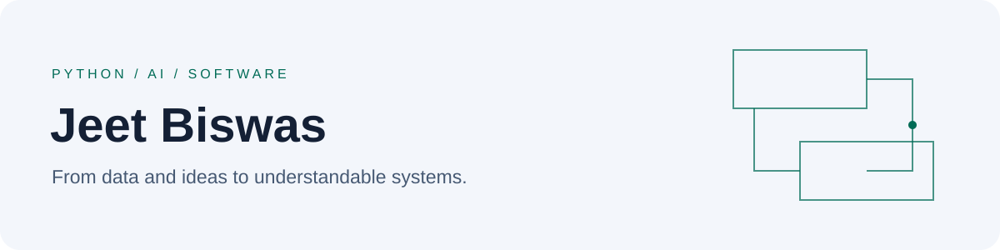

<picture>
  <source media="(prefers-color-scheme: dark)" srcset="assets/profile-dark.svg">
  <source media="(prefers-color-scheme: light)" srcset="assets/profile-light.svg">
  
</picture>

# Jeet Biswas

**AI/ML engineering, Python, and the software around the model.**

I build and explore applications that connect data, models, APIs, and useful interfaces.
My interests include document understanding, conversational applications, computer
vision, and the engineering needed to make experiments easier to run and evaluate.

## Projects

- **[Filewise document extraction](docs/projects/filewise.md)**:
  TXT/DOCX/PDF extraction connected to a Drive-backed Chrome extension through
  a local FastAPI companion. [Merged PR #20](https://github.com/SiddharthaGanguli/multimodal-smart-file-organizer/pull/20).
- **[DSA practice](docs/projects/dsa.md)**:
  algorithm patterns, reusable Python implementations, and executable edge-case tests.
- **[JeetGPT chat prototype](docs/projects/chatbot.md)**:
  Streamlit, LangChain, and a hosted Hugging Face model endpoint.
- **[Computer vision notebooks](docs/projects/computer-vision.md)**:
  OpenCV face detection and bounding-box visualization with pretrained cascades.
- **[ECG application foundation](docs/projects/ecg-foundation.md)**:
  React/Firebase authentication and a FastAPI backend scaffold; model work is planned.
- **[Unity gameplay prototypes](docs/projects/unity.md)**:
  C# exercises in movement, physics, collision handling, and game state.
- **[ML fundamentals notebooks](docs/projects/ml-fundamentals.md)**:
  scikit-learn Perceptron experiments, decision regions, and Pandas exploration.

## Tools in my projects

| Area | Tools | Example |
|---|---|---|
| Python applications | Python, FastAPI, Streamlit | [Filewise](docs/projects/filewise.md), [JeetGPT](docs/projects/chatbot.md) |
| Data and ML experiments | Pandas, scikit-learn, Jupyter | [ML fundamentals](docs/projects/ml-fundamentals.md) |
| Computer vision | OpenCV, Matplotlib | [Detection notebooks](docs/projects/computer-vision.md) |
| Web foundations | JavaScript, React, Vite, Firebase | [ECG application](docs/projects/ecg-foundation.md) |
| Interactive applications | C#, Unity | [Gameplay prototypes](docs/projects/unity.md) |
| Engineering practice | Git, tests, documented assumptions | [DSA](docs/projects/dsa.md), [merged extraction work](docs/projects/filewise.md) |

## How I work

I try to make inputs, failure states, and assumptions explicit; keep components
small enough to test; and connect claims to code or evaluation.
[Read my engineering approach](docs/engineering-workflow.md).

## What I am working on

I am developing my understanding of document extraction, dataset preparation,
model evaluation, and reproducible workflows. I also practice data structures
and algorithms alongside application development.

## Connect

For a project question or collaboration discussion, reach me at
[jeetbiswas816@gmail.com](mailto:jeetbiswas816@gmail.com).
You can also browse [my public repositories](https://github.com/jeet-biswas?tab=repositories).
